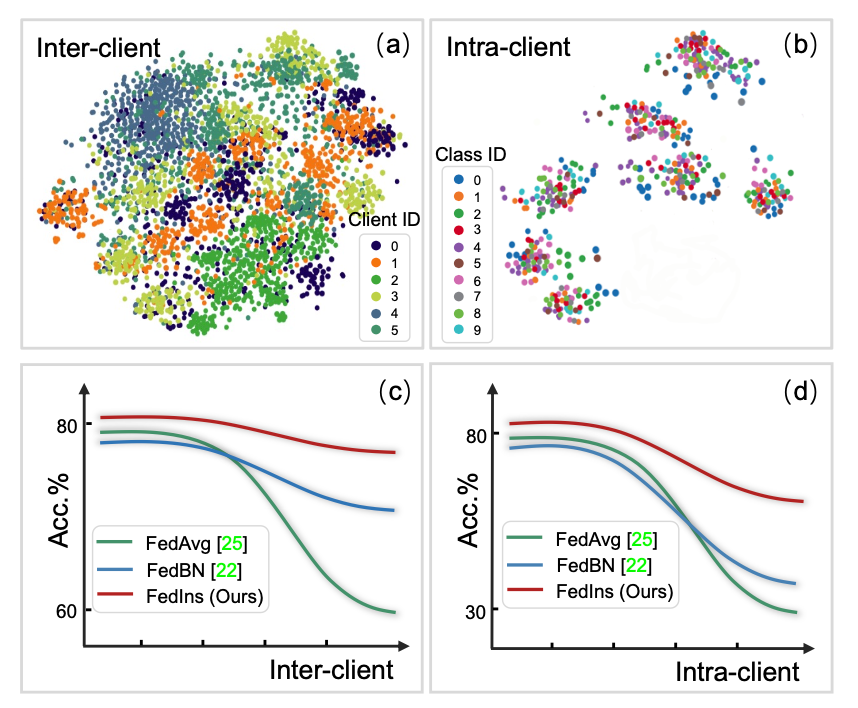
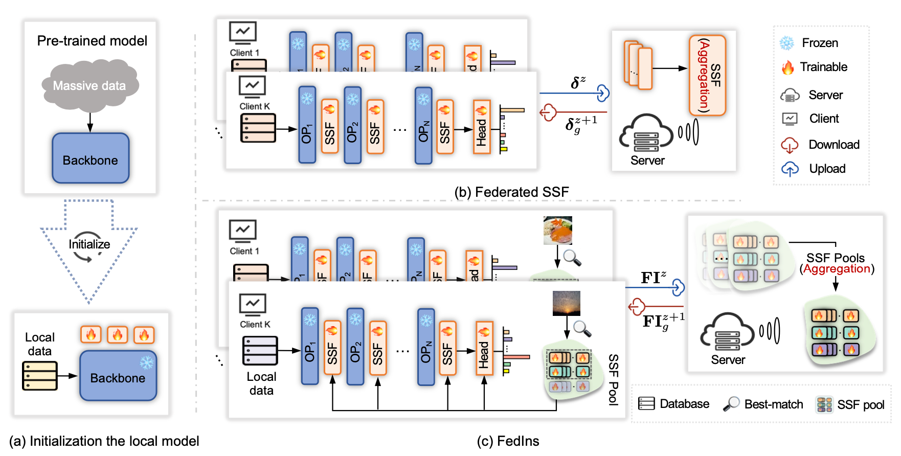

# Towards Instance-adaptive Inference for Federated Learning

This repo is the official implementation of "FedIns".

## Abstract

Federated learning (FL) is a distributed learning paradigm that enables multiple clients to learn a powerful global model by aggregating local training. However, the performance of the global model is often hampered by non-i.i.d. distribution among the clients, requiring extensive efforts to mitigate inter-client data heterogeneity. Going beyond inter-client data heterogeneity, we note that intra-client heterogeneity can also be observed on complex real- world data and seriously deteriorate FL performance. In this paper, we present a novel FL algorithm, i.e., FedIns, to handle intra-client data heterogeneity by enabling instance-adaptive inference in the FL framework. Instead of huge instance-adaptive models, we resort to a parameter-efficient fine-tuning method, i.e., scale and shift deep features (SSF), upon a pre-trained model. Specifically, we first train an SSF pool for each client, and aggregate these SSF pools on the server side, thus still maintaining a low communication cost. To enable instance-adaptive inference, for a given instance, we dynamically find the best-matched SSF subsets from the pool and aggregate them to generate an adaptive SSF specified for the instance, thereby reducing the intra-client as well as the inter-client heterogeneity. Extensive experiments show that our FedIns outperforms state-of-the-art FL algorithms, e.g., a 6.64% improvement against the top-performing method with less than 15% communication cost on Tiny-ImageNet.

## Motivation

<div align="center">
    
</div>

## Pipline

<div align="center">
    
</div>


## Get started

### Installation

```bash
# Clone this repo
git clone https://github.com/chunmeifeng/FedIns.git
cd FedIns

# Create a conda enviroment
conda create -n fedins python=3.7.15

# Activate the environment
conda activate fedins

# Install dependencies
pip install torch==1.7.0+cu110 torchvision==0.8.1+cu110 torchaudio==0.7.0 -f https://download.pytorch.org/whl/torch_stable.html
pip install fire==0.5.0
pip install timm==0.6.5
pip install ipdb==0.13.9
```

### Datasets

1. Cifar100 
2. DomainNet from [FedBN](https://github.com/med-air/FedBN)
3. TinyImagenet


### How to Run
```bash
CUDA_VISIBLE_DEVICES=0 python train_domainnet.py \
--data_base_path /your/domainnet/datapath \
--logout
```


## Citation

```  
  @article{feng2023towards,
    title={Towards Instance-adaptive Inference for Federated Learning},
    author={Feng, Chun-Mei and Yu, Kai and Liu, Nian and Xu, Xinxing and Khan, Salman and Zuo, Wangmeng},
    journal={arXiv preprint arXiv:2308.06051},
    year={2023}
    }
```